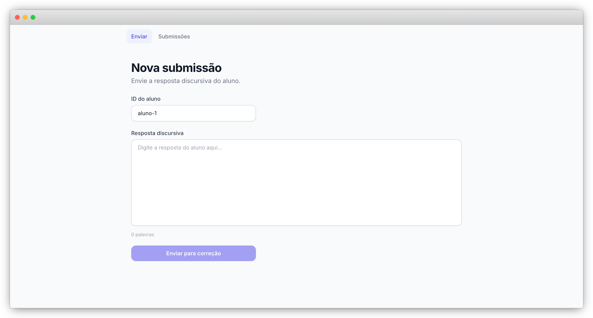
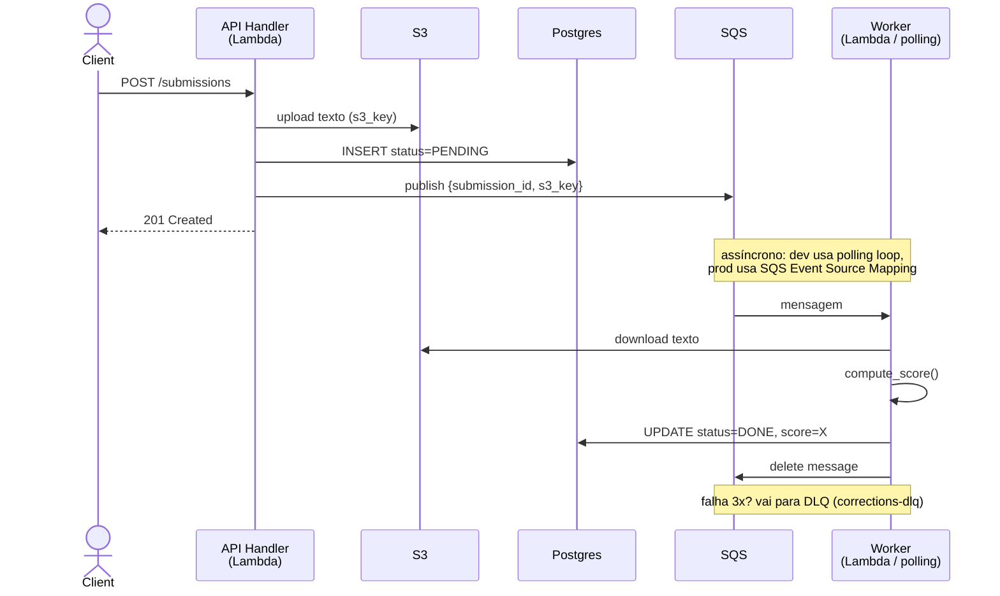
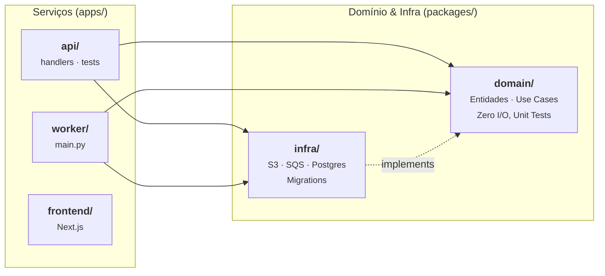
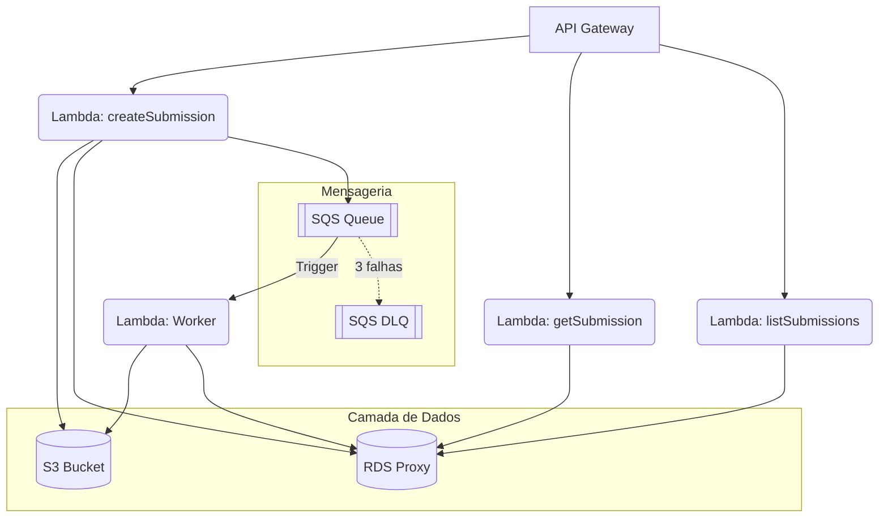

# Discursiva: Correção de Redações

Micro-serviço para submissão e correção assíncrona de textos discursivos. Stack: Python (asyncio) + Postgres + SQS + S3, com um frontend Next.js. Tudo sobe localmente com um único `docker compose up`.



## Contexto

O desafio pedia um back-end funcional em ~60 minutos. Como o tempo permitiu, optei por uma estrutura um pouco mais cuidadosa: separação de camadas, testes unitários sem I/O, schema SQL com tipos nativos e índices adequados. Nada que não estaria no projeto de produção real.

## Como rodar

Certifique-se de que o Docker está rodando e execute:

```bash
docker compose up
```

Aguarde tudo subir. O frontend será o último serviço disponível.

> _`.env.local` está versionado por conter apenas configurações locais, facilitando a execução do projeto. Em um projeto real, arquivos `.env` não devem ser commitados._

| Serviço    | URL                       |
|------------|---------------------------|
| API        | <http://localhost:8000>   |
| Frontend   | <http://localhost:3000>   |
| LocalStack | <http://localhost:4566>   |

**Testes:**

```bash
uv sync --all-groups
uv run pytest
```

A collection do Postman/Bruno está em `collection.json` na raiz.

## Endpoints

| Método | Rota                        | Descrição                              |
|--------|-----------------------------|----------------------------------------|
| POST   | `/submissions`              | Cria submissão, retorna `201` imediato |
| GET    | `/submissions/{id}`         | Detalhe, status e nota                 |
| GET    | `/submissions?student_id=X` | Lista paginada por aluno               |

```bash
curl -s -X POST http://localhost:8000/submissions \
  -H "Content-Type: application/json" \
  -d '{"student_id": "aluno_01", "text": "Texto da redação..."}'
```

## Arquitetura



A API responde `201` antes de qualquer processamento:

1. **Upload** do texto para S3 (LocalStack em dev, bucket real em prod).
2. **Insert** na tabela `submissions` com `status = PENDING`.
3. **Publish** na fila SQS com `submission_id` e `s3_key`.
4. **Worker** consome a mensagem, baixa o texto, calcula a nota e atualiza para `DONE`.

### Por que polling em dev e trigger em prod?

Em produção, a Lambda worker é acionada automaticamente pela própria fila: SQS Event Source Mapping cuida disso, sem polling manual. Em desenvolvimento esse mecanismo não existe localmente, a Lambda não está rodando como um runtime gerenciado, só existe como um container Python comum. Por isso o `worker/main.py` implementa um loop `asyncio` com long-polling (5 s de `WaitTimeSeconds` no `receive_message`). O código de processamento é o mesmo nos dois ambientes, só o ponto de entrada muda: `handler.py` para Lambda, `main.py` para dev.

## Estrutura do projeto



Clean Architecture em dois pacotes compartilhados:

- **`packages/domain`**: entidades, value objects, use cases e ports (interfaces). Zero dependências externas, zero I/O. Testes unitários rodam 100% em memória com fakes injetados.
- **`packages/infra`**: implementações concretas — `S3Storage`, `SQSQueue`, `PostgresSubmissionRepository`. `boto3` com `run_in_executor` para não bloquear o event loop, `asyncpg` para conexões assíncronas.

Os serviços em `apps/` não contêm lógica de negócio, só wiring e I/O.

## Scoring

Cinco critérios ortogonais, cada um valendo até 2 pontos (máximo 10):

| Critério            | Threshold                    |
|---------------------|------------------------------|
| Comprimento         | >= 50 palavras = 2 pts       |
| Parágrafos          | >= 3 parágrafos = 2 pts      |
| Vocabulário rico    | >= 5 palavras longas = 2 pts |
| Pontuação           | >= 3 sinais = 2 pts          |
| Diversidade lexical | palavra top < 10% = 2 pts    |

Lógica pura em [`packages/domain/src/discursiva_domain/services/corrector.py`](packages/domain/src/discursiva_domain/services/corrector.py). 100% testável de forma isolada.

## Schema SQL

Schema completo em [`packages/infra/src/discursiva_infra/postgres/migrations/schema.sql`](packages/infra/src/discursiva_infra/postgres/migrations/schema.sql).

O campo `updated_at` é mantido por um trigger Postgres (`set_updated_at`), não pela aplicação.

O `schema.sql` atende ao requisito do desafio e é suficiente para um schema que não vai evoluir. Em um produto real com deploys contínuos a limitação aparece cedo: o arquivo não carrega histórico, então não há como saber o que já foi aplicado em cada ambiente nem aplicar só o delta. O Alembic resolve exatamente isso, cada alteração vira uma revisão versionada, `alembic upgrade head` no CI leva qualquer ambiente ao estado correto a partir de onde ele está, e dá para reverter uma migration específica se necessário. O custo seria baixo: o projeto já usa `asyncpg`, e o Alembic tem suporte nativo a async via `run_sync`.

## AWS em produção



O `serverless.yml` já define tudo: funções, permissões IAM, bucket S3, fila SQS e DLQ. Para subir em produção seria só `sls deploy --stage prod`, sem tocar no código.

A API retorna `201` antes do worker processar porque não faz sentido deixar o cliente esperando uma correção que pode levar segundos. O SQS garante que a mensagem não se perde mesmo se o worker cair no meio do caminho, e a DLQ captura o que falhou três vezes sem perder dados silenciosamente.

Para otimização de custos e performance, o processamento de mensagens pode ser feito em batches. Isso reduz o número de invocações da Lambda e o custo de polling do SQS, sendo uma prática recomendada para cargas de trabalho elevadas.

O único gargalo real em escala seria o pool de conexões do Postgres com muitas Lambdas concorrentes. O RDS Proxy resolve isso sem mudança de código.

Para observabilidade: os logs já saem estruturados em JSON via `logging_config.py`, indexáveis no CloudWatch sem parser adicional. Para rastrear o caminho completo de uma requisição (API -> SQS -> Worker -> DB) colocaria AWS X-Ray. Um alarme no CloudWatch Metrics monitorando o tamanho da DLQ é o primeiro sinal de que algo está quebrando no worker.

## CI/CD

`ci.yml` roda `uv run pytest` em todo push para `dev`. `deploy.yml`, acionado em push para `master`, está estruturado mas requer configuração de secrets AWS para execução real.

## Simulando Deploy

É possível simular o comportamento de produção (Lambda + SQS Event Source Mapping) localmente usando o Serverless Framework com LocalStack.

Requisitos: Docker, [uv](https://docs.astral.sh/uv/getting-started/installation/) e Node.js instalados.

```bash
# 1. Instale as dependências
npm run sync

# 2. Derrube o ambiente padrão (se estiver rodando)
docker compose down -v

# 3. Deploy local
npm run deploy:local
```

Isso sobe Postgres e LocalStack via `packages/infra/compose.sls.yml` e realiza o deploy das funções. A API ficará disponível no endpoint gerado pelo `serverless-offline`.

Para testar, atualize o endpoint na collection do Postman/Bruno ou use `curl` (substitua `XXXXXXXXXX` pelo identificador gerado):

```bash
curl -s -X POST http://localhost:4566/restapis/XXXXXXXXXX/local/_user_request_/submissions \
  -H "Content-Type: application/json" \
  -d '{"student_id": "aluno_01", "text": "Texto da redação..."}'
```

Para rodar o frontend apontando para este deploy:

```bash
export INTERNAL_API_URL="http://localhost:4566/restapis/XXXXXXXXXX/local/_user_request_"
npm --prefix apps/frontend run dev
```

---

> "A simplicidade é o último grau de sofisticação." — **Leonardo da Vinci**
